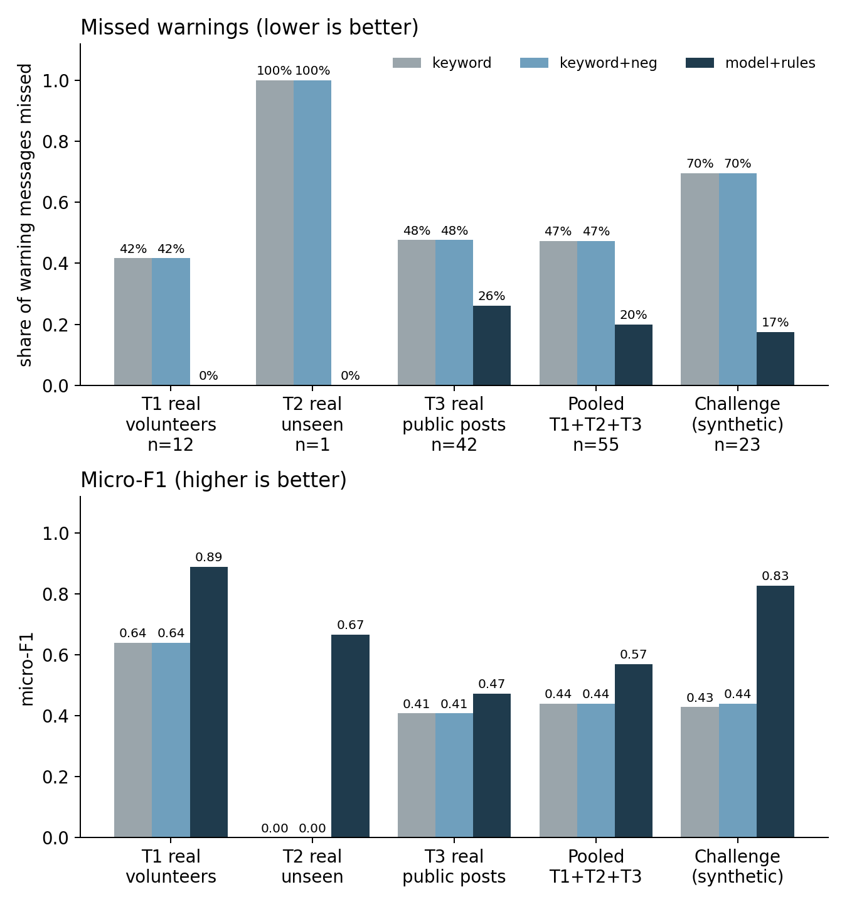
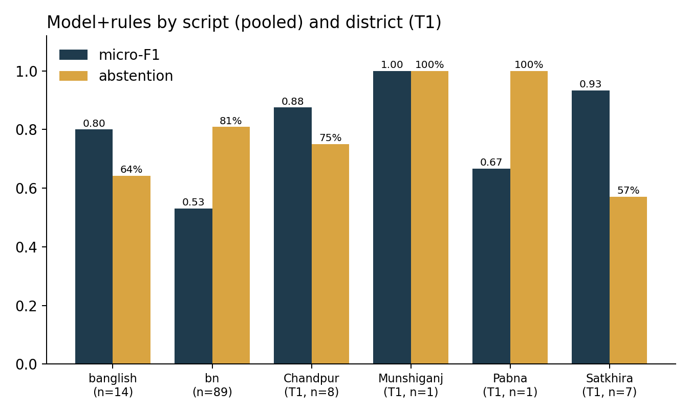
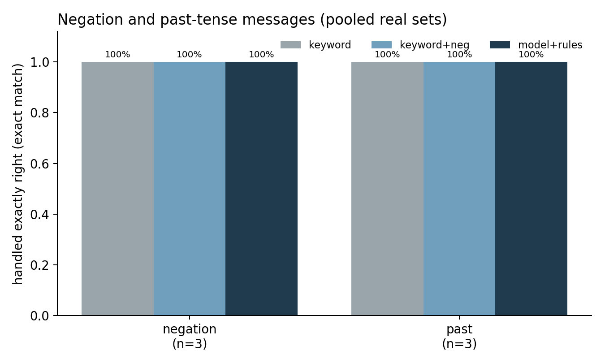
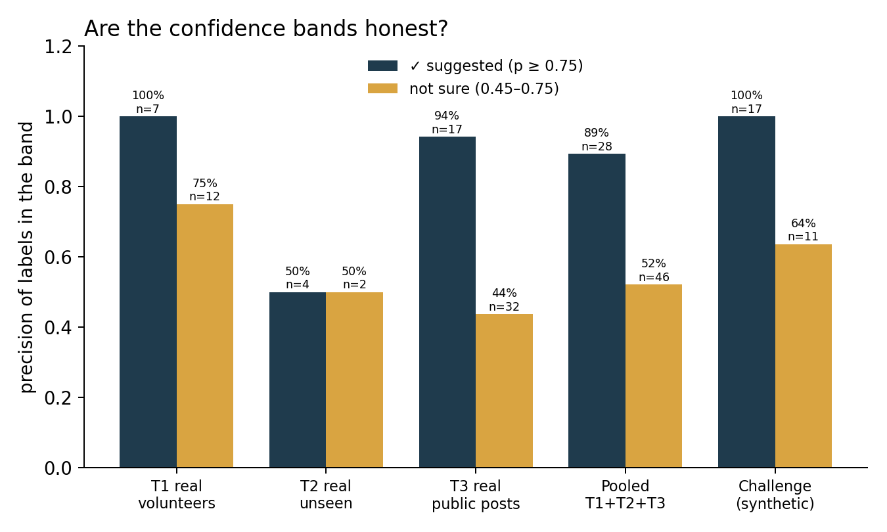

# Evaluation results

**Weak spots first.** On T3, model+rules missed the warning sign in 11 of 42 messages that had one (26%); 1 of those were not routed to a call either. On pooled, model+rules missed the warning sign in 11 of 55 messages that had one (20%); 1 of those were not routed to a call either. Weak labels on the pooled real sets: lethargy_restless (F1 0.48, n=15), fever_present (F1 0.06, n=28).

Shipped model: TF-IDF character n-grams + one-vs-rest logistic regression, C=4, trained on 580 constructed sentences. Real test sets: T1 (real volunteer messages), T2 (real, fully unseen), T3 (real public health posts). The challenge set is synthetic and reported only as a stress test.

## Headline: missed warnings next to micro-F1

A **missed warning** is a message with at least one real warning sign where the system suggests no warning sign at all. A **silent miss** is a missed warning that is also not routed to a call by "did not understand". A label counts as suggested from the "not sure" band (p ≥ 0.45) up.

| Set | System | Rows | Missed warnings | Silent misses | Warning-label recall | Micro-F1 | Exact match | Abstention |
|---|---|---|---|---|---|---|---|---|
| T1 | keyword | 17 | 5/12 (42%) | 0 | 54% | 0.64 | 59% | 53% |
| T1 | keyword+neg | 17 | 5/12 (42%) | 0 | 54% | 0.64 | 59% | 71% |
| T1 | model+rules | 17 | 0/12 (0%) | 0 | 92% | 0.89 | 76% | 71% |
| T2 | keyword | 6 | 1/1 (100%) | 0 | 0% | 0.00 | 50% | 83% |
| T2 | keyword+neg | 6 | 1/1 (100%) | 0 | 0% | 0.00 | 50% | 83% |
| T2 | model+rules | 6 | 0/1 (0%) | 0 | 100% | 0.67 | 50% | 50% |
| T3 | keyword | 80 | 20/42 (48%) | 0 | 41% | 0.41 | 49% | 72% |
| T3 | keyword+neg | 80 | 20/42 (48%) | 0 | 41% | 0.41 | 49% | 74% |
| T3 | model+rules | 80 | 11/42 (26%) | 1 | 59% | 0.47 | 42% | 82% |
| pooled | keyword | 103 | 26/55 (47%) | 0 | 43% | 0.44 | 50% | 70% |
| pooled | keyword+neg | 103 | 26/55 (47%) | 0 | 43% | 0.44 | 50% | 74% |
| pooled | model+rules | 103 | 11/55 (20%) | 1 | 66% | 0.57 | 49% | 79% |
| challenge | keyword | 33 | 16/23 (70%) | 0 | 29% | 0.43 | 30% | 67% |
| challenge | keyword+neg | 33 | 16/23 (70%) | 0 | 29% | 0.44 | 33% | 76% |
| challenge | model+rules | 33 | 4/23 (17%) | 0 | 79% | 0.83 | 70% | 55% |

## T3 by group

T3 tests general warning-sign wording in real public posts, not dengue follow-up messages.

| Set | System | Rows | Missed warnings | Silent misses | Warning-label recall | Micro-F1 | Exact match | Abstention |
|---|---|---|---|---|---|---|---|---|
| fever+sign | keyword | 25 | 7/20 (35%) | 0 | 50% | 0.35 | 0% | 48% |
| fever+sign | keyword+neg | 25 | 7/20 (35%) | 0 | 50% | 0.35 | 0% | 48% |
| fever+sign | model+rules | 25 | 4/20 (20%) | 1 | 68% | 0.42 | 0% | 72% |
| sign_only | keyword | 25 | 9/17 (53%) | 0 | 38% | 0.55 | 60% | 68% |
| sign_only | keyword+neg | 25 | 9/17 (53%) | 0 | 38% | 0.55 | 60% | 72% |
| sign_only | model+rules | 25 | 3/17 (18%) | 0 | 62% | 0.70 | 64% | 72% |
| other | keyword | 30 | 4/5 (80%) | 0 | 20% | 0.25 | 80% | 97% |
| other | keyword+neg | 30 | 4/5 (80%) | 0 | 20% | 0.25 | 80% | 97% |
| other | model+rules | 30 | 4/5 (80%) | 0 | 0% | 0.00 | 60% | 100% |

## T3 child posts

| Set | System | Rows | Missed warnings | Silent misses | Warning-label recall | Micro-F1 | Exact match | Abstention |
|---|---|---|---|---|---|---|---|---|
| child posts | keyword | 11 | 4/10 (40%) | 0 | 55% | 0.50 | 27% | 45% |
| child posts | keyword+neg | 11 | 4/10 (40%) | 0 | 55% | 0.50 | 27% | 45% |
| child posts | model+rules | 11 | 3/10 (30%) | 0 | 55% | 0.48 | 18% | 73% |
| other posts | keyword | 69 | 16/32 (50%) | 0 | 38% | 0.38 | 52% | 77% |
| other posts | keyword+neg | 69 | 16/32 (50%) | 0 | 38% | 0.38 | 52% | 78% |
| other posts | model+rules | 69 | 8/32 (25%) | 1 | 60% | 0.47 | 46% | 84% |

## False alarms

T3 posts in the "other" group (no listed sign) that get any confident (≥ 0.75) warning label:

| System | Posts | With confident warning | Rate |
|---|---|---|---|
| keyword | 30 | 1 | 3% |
| keyword+neg | 30 | 1 | 3% |
| model+rules | 30 | 0 | 0% |

Vashantor dialect false-alarm test: not run: the Vashantor corpus is not in data/raw.

## By script and district

**T1 by script**

| Set | System | Rows | Missed warnings | Silent misses | Warning-label recall | Micro-F1 | Exact match | Abstention |
|---|---|---|---|---|---|---|---|---|
| banglish | keyword | 8 | 2/5 (40%) | 0 | 60% | 0.73 | 62% | 50% |
| banglish | keyword+neg | 8 | 2/5 (40%) | 0 | 60% | 0.73 | 62% | 62% |
| banglish | model+rules | 8 | 0/5 (0%) | 0 | 100% | 0.88 | 75% | 75% |
| bn | keyword | 9 | 3/7 (43%) | 0 | 50% | 0.57 | 56% | 56% |
| bn | keyword+neg | 9 | 3/7 (43%) | 0 | 50% | 0.57 | 56% | 78% |
| bn | model+rules | 9 | 0/7 (0%) | 0 | 88% | 0.90 | 78% | 67% |

**T2 by script**

| Set | System | Rows | Missed warnings | Silent misses | Warning-label recall | Micro-F1 | Exact match | Abstention |
|---|---|---|---|---|---|---|---|---|
| banglish | keyword | 6 | 1/1 (100%) | 0 | 0% | 0.00 | 50% | 83% |
| banglish | keyword+neg | 6 | 1/1 (100%) | 0 | 0% | 0.00 | 50% | 83% |
| banglish | model+rules | 6 | 0/1 (0%) | 0 | 100% | 0.67 | 50% | 50% |

**T3 by script**

| Set | System | Rows | Missed warnings | Silent misses | Warning-label recall | Micro-F1 | Exact match | Abstention |
|---|---|---|---|---|---|---|---|---|
| bn | keyword | 80 | 20/42 (48%) | 0 | 41% | 0.41 | 49% | 72% |
| bn | keyword+neg | 80 | 20/42 (48%) | 0 | 41% | 0.41 | 49% | 74% |
| bn | model+rules | 80 | 11/42 (26%) | 1 | 59% | 0.47 | 42% | 82% |

**pooled by script**

| Set | System | Rows | Missed warnings | Silent misses | Warning-label recall | Micro-F1 | Exact match | Abstention |
|---|---|---|---|---|---|---|---|---|
| banglish | keyword | 14 | 3/6 (50%) | 0 | 50% | 0.53 | 57% | 64% |
| banglish | keyword+neg | 14 | 3/6 (50%) | 0 | 50% | 0.53 | 57% | 71% |
| banglish | model+rules | 14 | 0/6 (0%) | 0 | 100% | 0.80 | 64% | 64% |
| bn | keyword | 89 | 23/49 (47%) | 0 | 42% | 0.43 | 49% | 71% |
| bn | keyword+neg | 89 | 23/49 (47%) | 0 | 42% | 0.43 | 49% | 74% |
| bn | model+rules | 89 | 11/49 (22%) | 1 | 63% | 0.53 | 46% | 81% |

**T1 by district**

| Set | System | Rows | Missed warnings | Silent misses | Warning-label recall | Micro-F1 | Exact match | Abstention |
|---|---|---|---|---|---|---|---|---|
| Chandpur | keyword | 8 | 2/5 (40%) | 0 | 60% | 0.73 | 62% | 50% |
| Chandpur | keyword+neg | 8 | 2/5 (40%) | 0 | 60% | 0.73 | 62% | 62% |
| Chandpur | model+rules | 8 | 0/5 (0%) | 0 | 100% | 0.88 | 75% | 75% |
| Munshiganj | keyword | 1 | 0/1 (0%) | 0 | 100% | 1.00 | 100% | 0% |
| Munshiganj | keyword+neg | 1 | 0/1 (0%) | 0 | 100% | 1.00 | 100% | 100% |
| Munshiganj | model+rules | 1 | 0/1 (0%) | 0 | 100% | 1.00 | 100% | 100% |
| Pabna | keyword | 1 | 1/1 (100%) | 0 | 0% | 0.00 | 0% | 100% |
| Pabna | keyword+neg | 1 | 1/1 (100%) | 0 | 0% | 0.00 | 0% | 100% |
| Pabna | model+rules | 1 | 0/1 (0%) | 0 | 100% | 0.67 | 0% | 100% |
| Satkhira | keyword | 7 | 2/5 (40%) | 0 | 50% | 0.55 | 57% | 57% |
| Satkhira | keyword+neg | 7 | 2/5 (40%) | 0 | 50% | 0.55 | 57% | 71% |
| Satkhira | model+rules | 7 | 0/5 (0%) | 0 | 83% | 0.93 | 86% | 57% |

**T2 by district**

| Set | System | Rows | Missed warnings | Silent misses | Warning-label recall | Micro-F1 | Exact match | Abstention |
|---|---|---|---|---|---|---|---|---|
| Dhaka | keyword | 6 | 1/1 (100%) | 0 | 0% | 0.00 | 50% | 83% |
| Dhaka | keyword+neg | 6 | 1/1 (100%) | 0 | 0% | 0.00 | 50% | 83% |
| Dhaka | model+rules | 6 | 0/1 (0%) | 0 | 100% | 0.67 | 50% | 50% |

## Negation and past tense

**negation, T1**

| Set | System | Rows | Missed warnings | Silent misses | Warning-label recall | Micro-F1 | Exact match | Abstention |
|---|---|---|---|---|---|---|---|---|
| T1 | keyword | 3 | 0/3 (0%) | 0 | 100% | 1.00 | 100% | 0% |
| T1 | keyword+neg | 3 | 0/3 (0%) | 0 | 100% | 1.00 | 100% | 100% |
| T1 | model+rules | 3 | 0/3 (0%) | 0 | 100% | 1.00 | 100% | 100% |

**negation, pooled**

| Set | System | Rows | Missed warnings | Silent misses | Warning-label recall | Micro-F1 | Exact match | Abstention |
|---|---|---|---|---|---|---|---|---|
| pooled | keyword | 3 | 0/3 (0%) | 0 | 100% | 1.00 | 100% | 0% |
| pooled | keyword+neg | 3 | 0/3 (0%) | 0 | 100% | 1.00 | 100% | 100% |
| pooled | model+rules | 3 | 0/3 (0%) | 0 | 100% | 1.00 | 100% | 100% |

**past, T1**

| Set | System | Rows | Missed warnings | Silent misses | Warning-label recall | Micro-F1 | Exact match | Abstention |
|---|---|---|---|---|---|---|---|---|
| T1 | keyword | 3 | 0/3 (0%) | 0 | 100% | 1.00 | 100% | 0% |
| T1 | keyword+neg | 3 | 0/3 (0%) | 0 | 100% | 1.00 | 100% | 100% |
| T1 | model+rules | 3 | 0/3 (0%) | 0 | 100% | 1.00 | 100% | 100% |

**past, pooled**

| Set | System | Rows | Missed warnings | Silent misses | Warning-label recall | Micro-F1 | Exact match | Abstention |
|---|---|---|---|---|---|---|---|---|
| pooled | keyword | 3 | 0/3 (0%) | 0 | 100% | 1.00 | 100% | 0% |
| pooled | keyword+neg | 3 | 0/3 (0%) | 0 | 100% | 1.00 | 100% | 100% |
| pooled | model+rules | 3 | 0/3 (0%) | 0 | 100% | 1.00 | 100% | 100% |

## Band reliability (model+rules)

| Set | ✓ suggested: precision (n) | not sure: precision (n) |
|---|---|---|
| T1 | 100% (7) | 75% (12) |
| T2 | 50% (4) | 50% (2) |
| T3 | 94% (17) | 44% (32) |
| pooled | 89% (28) | 52% (46) |
| challenge | 100% (17) | 64% (11) |

## T1 and the v0.3 rule fix

All T1 rows were read before the v0.3 rule fix (seen_before_rule_fix=1); 0 T1 rows are unseen. T2 is fully unseen, so T2 is the clean check of the rules.

## Descriptive run over all source posts (T3 source dataset)

Share of posts in each original severity class that get at least one confident warning label. Descriptive only, not accuracy.

| Original class | Posts | With confident warning |
|---|---|---|
| Emergency | 1353 | 17% |
| General Query | 1181 | 1% |
| Routine | 1268 | 2% |
| Urgent | 1461 | 14% |

## Per label (pooled real sets, model+rules)

| Label | Precision | Recall | F1 | Support |
|---|---|---|---|---|
| abdominal_pain | 0.78 | 0.78 | 0.78 | 9 |
| persistent_vomiting | 0.91 | 0.77 | 0.83 | 13 |
| bleeding | 0.50 | 1.00 | 0.67 | 5 |
| lethargy_restless | 0.60 | 0.40 | 0.48 | 15 |
| low_urine | 0.40 | 1.00 | 0.57 | 4 |
| cold_clammy | 1.00 | 0.33 | 0.50 | 3 |
| breathing_difficulty | 1.00 | 0.58 | 0.74 | 12 |
| cannot_drink | 0.75 | 0.75 | 0.75 | 4 |
| fever_dropped | 0.60 | 1.00 | 0.75 | 3 |
| fever_present | 0.33 | 0.04 | 0.06 | 28 |
| feeling_better | 0.67 | 1.00 | 0.80 | 2 |
| test_result_mentioned | 0.00 | 0.00 | 0.00 | 0 |

All numbers above are also in `metrics.json`.
